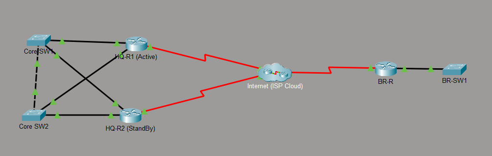
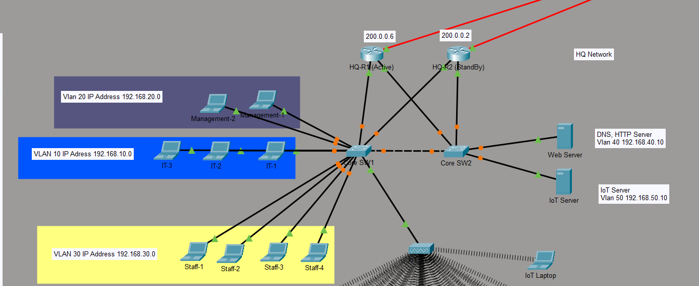
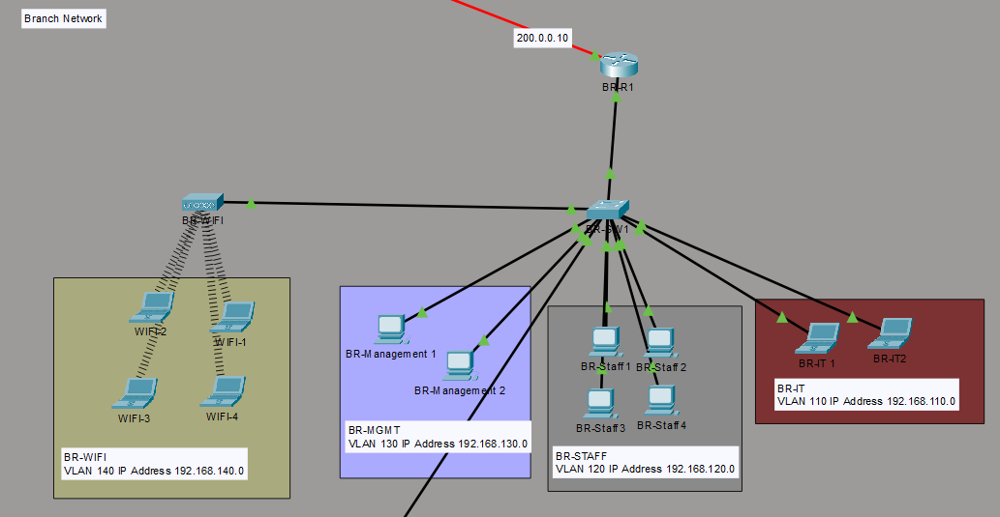
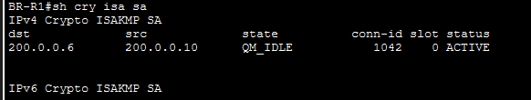
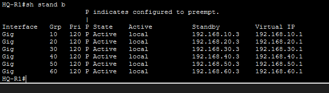

# 🏢 Multi-Site Enterprise Network (Cisco Packet Tracer)

## 📌 Overview
This project simulates a real-world multi-site enterprise network connecting a Headquarters (HQ) and a Branch office over a secure IPsec VPN tunnel.

The design focuses on security, high availability, segmentation, and centralized management — similar to real enterprise environments.

---

## 🎯 Objectives
- Build a scalable multi-site network
- Secure inter-site communication using VPN
- Implement redundancy to eliminate single points of failure
- Apply segmentation and access control policies
- Integrate IoT automation in a centralized model

---

## 🏗️ Network Architecture
- **HQ Site**
  - Dual routers (HSRP Active/Standby)
  - Core switches with redundant links
  - VLAN-based segmentation (IT, Staff, Management, Servers, IoT)

- **Branch Site**
  - Single router (Router-on-a-Stick)
  - VLAN segmentation (IT, Staff, Management, WiFi, IoT)

- **WAN**
  - Simulated Internet (ISP Cloud)
  - Site-to-Site IPsec VPN

---

## 🔧 Technologies Used
- Cisco Packet Tracer
- IPsec Site-to-Site VPN
- HSRP (Hot Standby Router Protocol)
- VLANs & Inter-VLAN Routing
- DHCP (Centralized IP Assignment)
- ACLs (Access Control Lists)
- NAT with VPN Exemption
- IoT Devices & Automation

---

## 🔐 Key Features

### 🔹 IPsec VPN
- Secure encrypted tunnel between HQ and Branch  
- NAT exemption configured for proper VPN operation  
- Verified using `show crypto isakmp sa` (QM_IDLE / ACTIVE)

---

### 🔹 HSRP Redundancy
- Dual routers at HQ (Active / Standby)  
- Preemption enabled  
- Virtual IP used as default gateway  
- Eliminates single point of failure  

---

### 🔹 VLAN Segmentation
- Logical separation of departments:
  - IT  
  - Staff  
  - Management  
  - Servers  
  - IoT  
  - WiFi  

---

### 🔹 Centralized DHCP
- Automatic IP assignment per VLAN  
- Simplifies network management  

---

### 🔹 ACL Security Policies
- IoT isolation (only allowed to IoT server + DNS)  
- Staff restrictions (no access to sensitive services)  
- WiFi isolation (internet only)  
- Least-privilege model enforced  

---

### 🔹 IoT Smart Building
- Fire alarm automation (detectors → sirens & lights)  
- RFID-based server room access control  
- Motion-triggered lighting system  
- Branch IoT managed centrally from HQ via VPN  

---

## 🖼️ Network Topology

### 🔸 Full Topology

---

### 🔸 HQ Network (VLANs + Servers)

---

### 🔸 Branch Network

---

## ✅ Verification & Testing

### 🔹 VPN Status

- Status: **QM_IDLE / ACTIVE**
- Confirms successful IPsec tunnel establishment  

---

### 🔹 HSRP Status

- HQ-R1: Active  
- HQ-R2: Standby  
- Virtual IP functioning as default gateway  

---

### 🔹 Connectivity Tests
- Branch → Internet ✔️  
- Branch → HQ (via VPN) ✔️  
- IoT restrictions enforced ✔️  
- WiFi isolation verified ✔️  

---

## 🚀 Results
- Secure communication between sites achieved  
- High availability using HSRP  
- Proper segmentation and access control enforced  
- Centralized IoT and DHCP working successfully  

---

## 🧠 Key Learning
The difference between understanding networking concepts and deploying them in real scenarios is significant.

This project helped bridge that gap through hands-on implementation, troubleshooting, and validation.

---
## 📂 Project File
Download and explore the full Packet Tracer project:

[multi-site-enterprise-network.pkt](multi-site-enterprise-network.pkt)

## 📎 Author
**Yazan Khaled**  
Networking Enthusiast | ICT Student
